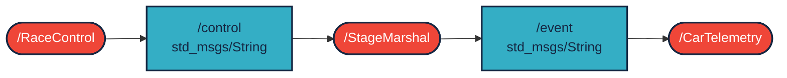

# Rally Communication Simulator (ROS 2 Humble)

## Leírás
Ez a projekt egy rally verseny kommunikációját szimulálja ROS 2 környezetben.
A rendszer három fő node-ból áll:
- **RaceControl** – központi irányítás, amely vezérlő üzeneteket és riasztásokat küld.
- **StageMarshal** – pályabíró, aki figyeli a verseny szakaszt, és eseményeket küld vissza.
- **CarTelemetry** – autó telemetria adatait (sebesség, fordulatszám, hőmérséklet) publikálja.

A kommunikáció QoS beállításokkal szimulálja a rádiós veszteséget (Best Effort).

---
## Clone pacages

``` r
cd ~/ros2_ws/src
```
```  r
git clone https://github.com/gerike041/urb_lx1_aj
```

## Telepítés és build

```r
cd ~/ros2_ws
```
```r
colcon build --packages-select rally_com --symlink-install
```
## Nefelejetsd el sorcoli a ros2 parancsok elött
```r
ros2 launch rally_comm rally_launch.launch.py
```
### Terminal 1
```r
ros2 run rally_comm race_control
```

### Terminal 2 - Stage marshal
```r
ros2 run rally_comm stage_marshal
```

### Terminal 2 - Car telemetry
```r
ros2 run rally_comm car_telemetry
```

## Kommunikációs diagaramm


