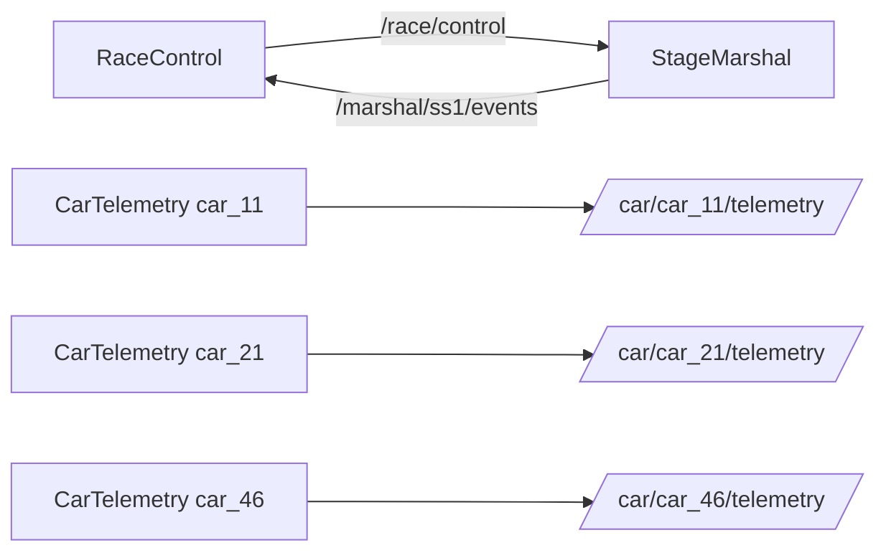

# Rally Communication Simulator (ROS 2 Humble)

## Leírás
Ez a projekt egy rally verseny kommunikációját szimulálja ROS 2 környezetben.
A rendszer három fő node-ból áll:
- **RaceControl** – központi irányítás, amely vezérlő üzeneteket és riasztásokat küld.
- **StageMarshal** – pályabíró, aki figyeli a verseny szakaszt, és eseményeket küld vissza.
- **CarTelemetry** – autó telemetria adatait (sebesség, fordulatszám, hőmérséklet) publikálja.

A kommunikáció QoS beállításokkal szimulálja a rádiós veszteséget (Best Effort).

---
## Clone packages

``` r
cd ~/ros2_ws/src
```
```  r
git clone https://github.com/gerike041/urb_lx1_aj
```

## Telepítés és build

```r
cd ~/ros2_ws
```
```r
colcon build --packages-select rally_comm --symlink-install

```
```r
source install/setup.bash
```
```r
ros2 launch rally_comm rally_demo.launch.py
```
#### Ezzel elindul minden


## Tesztelés
### Aktív topicok listázása

```r
ros2 topic list
```
### Belehallgatás egy topicba
```r
ros2 topic echo /race/control
```

```r
ros2 topic echo /car/car_11/telemetry
```
```r
ros2 topic echo /marshal/ss1/events
```


## Kommunikációs diagram


